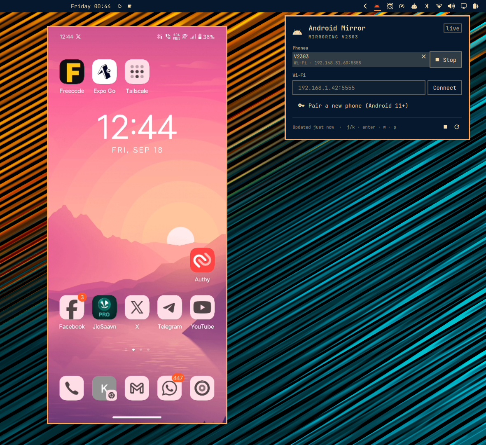

# Android Mirror for Omarchy

Mirror and control your Android phone from the Omarchy bar, or use its camera
as a **webcam** in Google Meet, Teams, Zoom and OBS. USB or Wi-Fi, keyboard
and mouse, ~35–70 ms latency, no root, nothing to install on the phone. A
native Omarchy panel over [`adb`](https://developer.android.com/tools/adb)
and [`scrcpy`](https://github.com/Genymobile/scrcpy).

<p align="center">
  
</p>

## Features

- Bar icon shows whether a phone is ready / mirroring
- Left click: panel with every connected phone and one-click **Mirror**
- Right click the icon: mirror the first ready phone (or stop the running mirror)
- **Install** button for the two packages it needs; finds the Android SDK's adb by itself
- **Enable Wi-Fi** on a USB-connected phone in one click, then unplug the cable
- **Pair** an Android 11+ phone over Wi-Fi with the pairing code — no cable, ever
- Connect to a remembered `ip:port`
- Turn the phone screen off while mirroring, keep it awake, forward audio (Android 11+)
- Floating, pinned, rotation-following window — no Hyprland config to edit
- **Webcam**: the phone's front or back camera shows up as *Android Mirror
  Camera* in any app's camera picker (Android 12+), with a one-click flip
- All scrcpy knobs (max size, bitrate, extra args) in the widget settings

## Install — three steps

1. **Add the plugin** (it lands in your bar automatically):

   ```sh
   omarchy plugin add https://github.com/ayandexyz/omarchy-android-mirror.git --enable
   ```

2. **Click the Android icon → Install.** A terminal opens and runs
   `omarchy pkg add scrcpy android-tools android-udev` (asks for your password).
   Skip this if you already have adb + scrcpy; the plugin also finds the
   Android SDK's `~/Android/Sdk/platform-tools/adb` on its own.

3. **On the phone**, turn on *Settings → Developer options → USB debugging*
   (tap *Build number* 7 times under *About phone* if Developer options is
   hidden), plug in with USB, and tap **Allow** on the prompt.

Click **Mirror**. Nothing else to configure: the mirror window floats, stays
pinned across workspaces, and follows the phone's rotation — the plugin
registers the Hyprland window rule itself.

### Using the phone as a webcam

Laptops with no camera, or a bad one: the phone's camera becomes a regular
Linux camera device that Meet, Teams, Zoom, Discord, OBS and Chrome all list.

1. In the panel's **Webcam** section click **Set up** (one time). A terminal
   opens and, with your password, installs `v4l2loopback-dkms` plus your
   kernel's headers, writes `/etc/modprobe.d/android-mirror-webcam.conf` and
   `/etc/modules-load.d/android-mirror-webcam.conf`, and loads the module.
   After that `/dev/video42` exists at every boot as *Android Mirror Camera*.
2. Press the camera button (󰄀) on a phone's row, or `c`. The phone needs
   Android 12 or newer; USB or Wi-Fi both work.
3. In the app, pick **Android Mirror Camera** as the camera.

**Back camera / Front camera** in the panel (or `f`) flips between the two,
restarting the stream. Size (720p default), fps, selfie-mirror and torch are
in the widget settings. Mirroring and the webcam can run at the same time.

Nothing runs in the background when the webcam is off: it is one scrcpy
process with `--video-source=camera --v4l2-sink`, started and stopped by the
panel. The loopback device itself is passive; apps see it as a camera with no
signal until you press 󰄀.

### Going wireless

With the phone still on USB, press the **Wi-Fi** button on its row (or `w`).
Wait for "Wi-Fi ready … you can unplug the cable", unplug, and click Mirror
on the Wi-Fi row. This lasts until the phone reboots.

Cable-free from the start (Android 11+): *Developer options → Wireless
debugging → Pair device with pairing code*, then **Pair a new phone** in the
panel and type the address and code shown.

### Wi-Fi is slower than USB — tuning

Over Wi-Fi the plugin automatically uses a lighter profile (800 px, 2 Mbps,
30 fps, no audio, screen kept on) because the phone's *uplink* is the
bottleneck. If it still lags: move both devices to **5 GHz** (biggest win),
get the phone closer to the router, and on the phone set *Keep Wi-Fi on during
sleep: Always*. Tweak the Wi-Fi values in the widget settings.

### Troubleshooting

- *tap Allow on the phone* → the USB debugging prompt is waiting on the phone.
- *udev: no USB permission* → `sudo usermod -aG adbusers $USER`, then log out and in.
- Phone not listed at all → the USB mode is "charge only"; switch to *File transfer*.
- On vivo/OPPO/Xiaomi, also enable *USB debugging (Security settings)* or
  keyboard/mouse input is blocked.
- *Webcam needs Android 12+* → scrcpy's camera source only exists there.
- *`/dev/video42` exists but is "…"* → another tool already loaded
  `v4l2loopback` with its own options. Set *webcam device* in the widget
  settings to that tool's node, or `sudo modprobe -r v4l2loopback && sudo
  modprobe v4l2loopback` once nothing is using it.
- The app shows a black frame → start the phone camera *before* joining, or
  toggle the camera off and on in the app after pressing 󰄀.
- DKMS failed after a kernel update → `sudo pacman -S --needed
  v4l2loopback-dkms` again once the matching `-headers` package is installed;
  the plugin's **Set up** does exactly that.

## Remove

```sh
omarchy plugin remove io.github.ayan-de.android-mirror
```

That deletes the plugin and its bar entry. It leaves the packages it
installed (`scrcpy`, `android-tools`, `android-udev`) in place — remove them
with `sudo pacman -Rs scrcpy android-tools android-udev` if you no longer want
them. If you ran the webcam **Set up**, also:

```sh
sudo rm /etc/modprobe.d/android-mirror-webcam.conf /etc/modules-load.d/android-mirror-webcam.conf
sudo pacman -Rs v4l2loopback-dkms   # optional; keep it if anything else uses a virtual camera
```

Nothing else is written: the plugin never edits your Hyprland or shell
config; the window rule it registers lives only in the running compositor.

## Dependencies

| Dependency | Package (Arch) | Used for |
|---|---|---|
| `adb` | `android-tools` | listing phones, Wi-Fi pairing/connect, rotation polling |
| `scrcpy` | `scrcpy` | the mirror window, keyboard and mouse |
| udev rules | `android-udev` | USB access without root |
| `hyprctl`, `jq` | Omarchy base | float/pin the window and follow rotation |
| `v4l2loopback` | `v4l2loopback-dkms` + `<kernel>-headers` | webcam only: the virtual camera device |

The **Install** button runs `omarchy pkg add scrcpy android-tools android-udev`
in a terminal, which uses `sudo` (you are asked for your password). The
webcam **Set up** button runs `bin/setup-webcam.sh` the same way: it installs
`v4l2loopback-dkms` and the running kernel's headers package, writes the two
one-line config files named above, and runs `modprobe`. Those are the only
privileged actions in the plugin; neither runs unless you click. Nothing is
downloaded from anywhere but the Arch and Omarchy repositories.

## Keyboard

Inside the panel:

- `j` / `k` or arrows: select a phone
- `enter` / `space`: mirror the selected phone (or stop)
- `c`: use the selected phone as the webcam (or stop it)
- `f`: flip between front and back camera
- `w`: enable Wi-Fi on the first USB phone
- `p`: show / hide pairing
- `r`: refresh
- `esc`: close

## IPC

```sh
omarchy-shell io.github.ayan-de.android-mirror mirror   # mirror first ready phone
omarchy-shell io.github.ayan-de.android-mirror stop
omarchy-shell io.github.ayan-de.android-mirror webcam   # phone camera → Android Mirror Camera
omarchy-shell io.github.ayan-de.android-mirror webcamStop
omarchy-shell io.github.ayan-de.android-mirror flip     # front ↔ back
omarchy-shell io.github.ayan-de.android-mirror install  # open the package install terminal
omarchy-shell io.github.ayan-de.android-mirror setup    # open the webcam setup terminal
omarchy-shell io.github.ayan-de.android-mirror toggle   # open/close the panel
```

Bind `mirror` to a key in `~/.config/hypr/bindings.conf` if you like.

## Layout

```
manifest.json      plugin identity + settings schema
Panel.qml          bar icon + panel UI (the `barWidget` entry point)
MirrorBackend.qml  adb / scrcpy processes and state
Model.js           pure parsing + argument building (tested)
bin/               hypr-window-rule.sh (float/pin rule), fit-window.sh (rotation),
                   setup-webcam.sh (one-time v4l2loopback install, needs sudo)
tests/             node --test tests/
```

## Development

```sh

omarchy plugin add "$PWD" --enable     # or rsync into ~/.config/omarchy/plugins/<id>/
omarchy plugin validate ~/.config/omarchy/plugins/io.github.ayan-de.android-mirror
node --test tests/
```

## License

MIT
